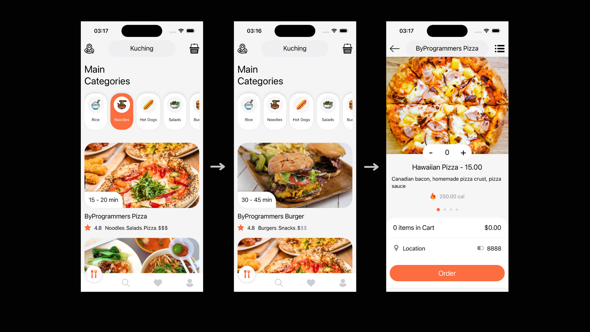

## Food Delivery App

- FoodDeliveryApp utilizes modern technologies to develop a user-friendly mobile application:

- React Native: Enables rapid and efficient development of mobile applications. React Native allows for the creation of performant applications using the same code base for both iOS and Android platforms.

- React Navigation: Facilitates easy navigation within the application. React Navigation supports various navigation types such as stack, tab, and drawer, making it easier for users to explore the content within the application.

- React Native Maps: Used for map integration, assisting users in finding restaurants and tracking deliveries. React Native Maps enables the creation of interactive maps and provides location-based services to users.

## Image

# foodDeliveryApp
